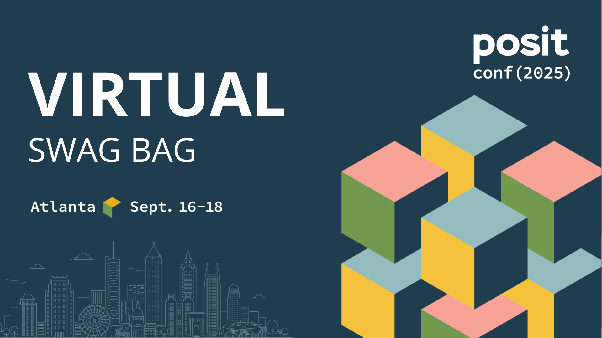

# posit::conf(2024) Virtual Swag Bag

 The virtual experience of our hybrid conference is a unique experience that brings together R and Python enthusiasts from different countries, industries, and backgrounds to meet, chat, and share in the excitement of posit::conf(). Join our virtual networking starting on August 12, and livestreams beginning August 13!

Registration is required to access the virtual event portal and networking opportunities. By registering for the conference, you gain access to:

* Livestreams of the keynote and talks led by renowned speakers in data
* On-demand recordings available shortly after the scheduled run time of keynotes and talks
* Question and answer sessions alongside other attendees during the talks
* The opportunity to chat, share, and learn with other attendees, no matter where they are, through our virtual networking platform 

[Register here!](https://reg.conf.posit.co/flow/posit/positconf24/reg/login)

Have fun with our virtual swag bag as you enjoy the amazing talks and connect with the fantastic community at the conference!

